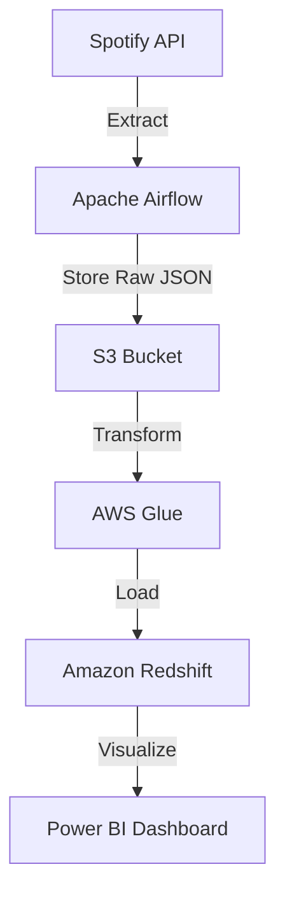

# 🎧 Real-Time Data Pipeline: Spotify Analytics

**Tech Stack:** `Python`, `Apache Airflow`, `AWS (S3, Glue, Redshift)`, `Power BI`

## 📌 Overview

This project demonstrates a real-time data pipeline that extracts Spotify track data via API, processes it with AWS services, and visualizes insights through Power BI dashboards.

## 🛠️ Tools & Technologies

- **Spotify API** – Data source for real-time track metadata  
- **Apache Airflow** – Workflow orchestration and scheduling  
- **Amazon S3** – Data lake for storing raw JSON  
- **AWS Glue** – ETL tool to convert JSON to columnar format (Parquet)  
- **Amazon Redshift** – Data warehouse for analytics  
- **Power BI** – Dashboard and visualization platform

- ## ⚙️ Architecture

## ✨ Features

- **Automated ETL:** Airflow orchestrates regular extraction of data from Spotify API  
- **Cloud Storage:** Raw data stored in Amazon S3 for flexible access  
- **ETL with AWS Glue:** Efficient transformation from JSON to Parquet  
- **Analytics-ready Redshift:** Transformed data loaded into Redshift tables  
- **Interactive Dashboards:** Power BI connected to Redshift for insight generation

